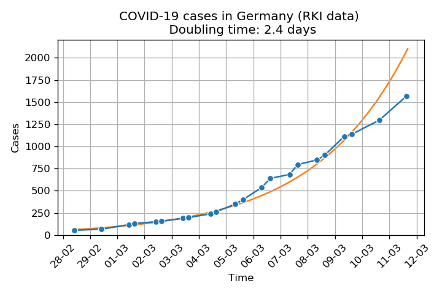

## COVID-19 cases in Germany

**The format of data on RKI website changes too often for me to maintain the scraping script. Therefore my dataset will not be further updated. The actual number of cases in Germany can be found at Wikipedia (https://de.wikipedia.org/wiki/COVID-19-F%C3%A4lle_in_Deutschland#Infektionsf%C3%A4lle_pro_Bundesland)**

The repository contains scripts to download actual and historic data on COVID-19 cases in Germany from Robert Koch Institute (https://www.rki.de/DE/Content/InfAZ/N/Neuartiges_Coronavirus/Fallzahlen.html) and to do some basic analysis. The scripts can be run from `covid19-germany.ipynb` (warning: will not work for data after 11.03). Or you can just download the scraped [dataset](covid19-germany-lands.csv). 

